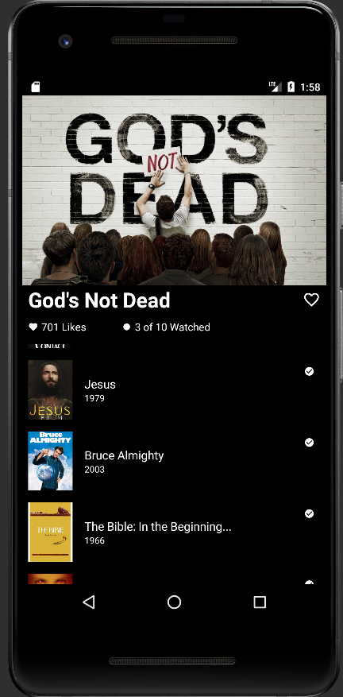

Desafio_Mobile2You

O App é semelhante ao a tela de seleção de filmes do Aplicativo TodoMovies.

É apresentado um filme selecionado, a sua quantidade de curtidas, e a quantidade de filmes assistidos de todos que são listados como filmes similares.
Também é apresentado a quantidade de filmes simliares, através de uma lista que é consumida da API.

Linguagems : Kotlin
Libs: Retrofit, Glide, RecyclerView
API: themoviedb.org

Experiência com o Desafio: Sou grato a Mobile2You por me oportunizar a fazer esse desafio, nele pude testar os meus conhecimentos, confesso que tive algumas dificuldades e não consegui completar todas as etapas propostas pelo desafio.

Mas se for possível, gostaria de recebeu um feedback sobre o meu desempenho, sobre o que e como devo melhorar, e quais as melhores maneiras de seguir o meu aprendizado, para essa jornada de desenvolvedor mobile android.

<h1 align="center">

